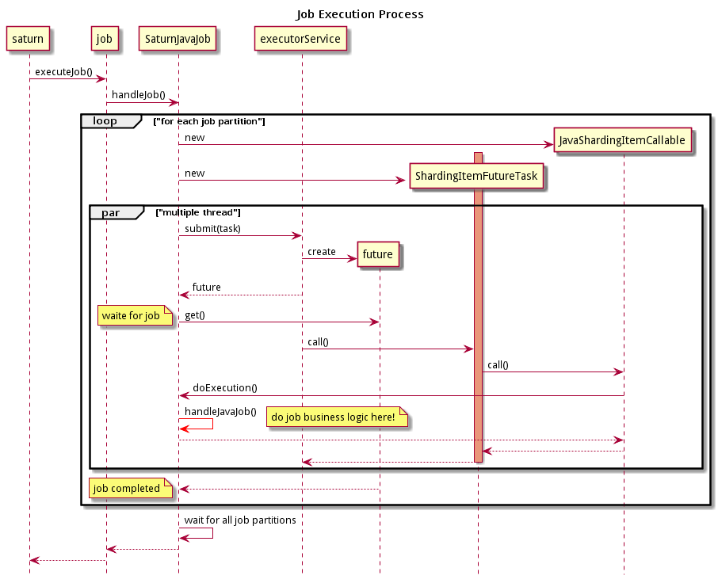

# 类SaturnJavaJob

继承自CrondJob：

```java
public class SaturnJavaJob extends CrondJob {}
```

## 主要方法

### handleJob()方法

去掉细节，主要处理逻辑为：

```java
protected Map<Integer, SaturnJobReturn> handleJob(final SaturnExecutionContext shardingContext) {
    for (final Entry<Integer, String> shardingItem : shardingItemParameters.entrySet()) {
        try {
            ShardingItemFutureTask shardingItemFutureTask = new ShardingItemFutureTask(......);
            Future<?> callFuture = executorService.submit(shardingItemFutureTask);
    }
}
```

即循环处理每个分片，每个分片的处理方式是创建`ShardingItemFutureTask`这个task，然后交给`executorService`来执行。之后通过Future等到处理结果并汇报。

### doExecution()方法

doExecution()方法是作业真正的业务处理逻辑：

```java
@Override
public SaturnJobReturn doExecution(...) throws Throwable {
    return handleJavaJob(...);
}
```

继续，去掉各种细节，主要处理逻辑为：

```java
public SaturnJobReturn handleJavaJob(...) throws Throwable {
	// 通过反射调用jobBusinessInstance对象的handleJavaJob()方法
    Object ret = jobBusinessInstance.getClass().getMethod("handleJavaJob", ...).invoke(jobBusinessInstance, ...);
    // 然后再把返回的result克隆一遍
    // 注意只有换用classloader做一次克隆之后返回的结果才可以访问
    SaturnJobReturn saturnJobReturn = (SaturnJobReturn) JavaShardingItemCallable.cloneObject(ret,...);
    return saturnJobReturn;
}
```

注意执行期间需要切换classloader：

```java
public SaturnJobReturn handleJavaJob(...) throws Throwable {
    //记录当前的classloader以备执行作业之后切换回来
    ClassLoader oldClassLoader = Thread.currentThread().getContextClassLoader();
    ClassLoader jobClassLoader = saturnExecutorService.getJobClassLoader();
    // 将当前线程的classloader设置为jobClassLoader
    Thread.currentThread().setContextClassLoader(jobClassLoader);
    try {
        ...
        return saturnJobReturn;
    } finally {
        // 将当前线程的classloader切换回来	Thread.currentThread().setContextClassLoader(oldClassLoader);
    }
}
```

Saturn的系统运行环境和作业的运行环境通过classloader隔离。因此当线程调用从Saturn进入作业时，需要切换为作业的classloader。一旦执行完成退回Saturn时，再切换回原来的classloader。

## 作业调用流程


作业调用的流程，前面看到两处：

1. 作业的执行入口是executeJob()模板方法，然后进入handleJob()方法。而SaturnJavaJob的handleJob()的处理逻辑是构建一个task扔给executor工作线程

2. 作业的业务处理逻辑实现在doExecution()方法，SaturnJavaJob的doExecution()方法是直接调用handleJavaJob()。

handleJob()方法和handleJavaJob()方法之间是怎么串起来的？

1. 首先构建`ShardingItemFutureTask`实例

	在handleJob()方法中进行。首选创建一个JavaShardingItemCallable对象，然后再创建ShardingItemFutureTask：

    ```java
    ShardingItemFutureTask shardingItemFutureTask = new ShardingItemFutureTask(createCallable(jobName, key, itemVal, timeoutSeconds, shardingContext, this), null);
    ```

2. `ShardingItemFutureTask`的call()方法，去掉细节就是调用callable.call()

    ```java
    SaturnJobReturn ret = callable.call();
    ```

3. `JavaShardingItemCallable`的call()方法，去掉细节就是调用saturnJob.doExecution()

    ```java
    saturnJob.doExecution(jobName, item, itemValue, shardingContext, this);
    ```

4. doExecution()方法调用handleJavaJob()

    ```java
    @Override
    public SaturnJobReturn doExecution(...) throws Throwable {
        return handleJavaJob(...);
    }
    ```

详细调用流程如下：




