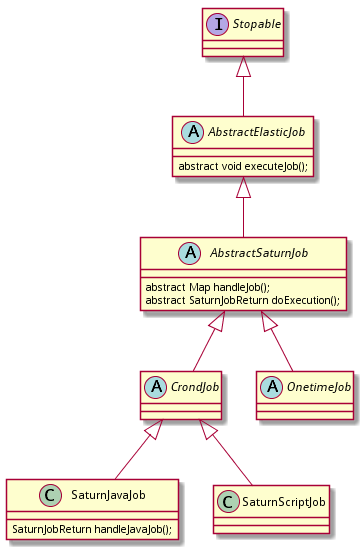

# Job/作业

## 定义

### 作业的定义

作业(Job)是可以独立运行的脚本(shell作业)或者具备某项功能的函数实现(java、消息作业)。

### 作业分片的定义

作业可并发执行在多个执行节点(Executor)上，作业分片定义了作业并发执行的数量以及执行编号。比如作业分片为2，则表示作业最多可以并发执行在2个执行结点上，执行编号为0和1。

作业分片调度指将作业分片指派给执行结点。比如A作业有5个分片（分片0，1，2，3，4），一共有两个执行结点E1和E2，将0，1，2指派给E1；3，4指派给E2。

## 实现

Job类继承关系：

